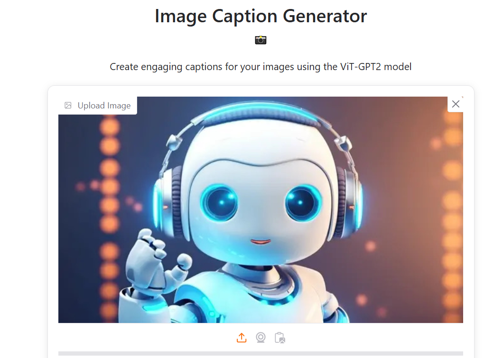

# Image Caption Generator

## Overview
The **Image Caption Generator** is a deep learning-based web application that automatically generates descriptive captions for uploaded images using the `nlpconnect/vit-gpt2-image-captioning` model. This project is hosted on Hugging Face Spaces using Gradio for the interface, allowing users to upload an image, choose a vibe (e.g., Fun, Funny, Serious), and add an optional prompt to create a customized caption.

## Features
- **Image Captioning**: Generates captions for uploaded images using the `nlpconnect/vit-gpt2-image-captioning` model.
- **Vibe Selection**: Choose from six vibes (Fun, Funny, Serious, Cute, Happy, Sad) to customize the tone of the caption.
- **Additional Prompt**: Add an optional prompt to further personalize the caption.
- **Dark/Light Mode**: Toggle between dark and light themes for better usability.
- **Mobile Responsive**: Optimized for both desktop and mobile devices.
- **Enhanced Captions**: Captions are enhanced with vibe-specific prefixes, emojis, and descriptive words for a more engaging output.

## How It Works
1. The user uploads an image via the web interface.
2. The user selects a vibe (e.g., Happy, Funny) and optionally provides an additional prompt.
3. The `nlpconnect/vit-gpt2-image-captioning` model processes the image using a Vision Transformer (ViT) for feature extraction and GPT-2 for caption generation.
4. The generated caption is enhanced with vibe-specific prefixes, emojis, and descriptive words.
5. The final caption is displayed to the user.

## Tech Stack
- **Python**: For backend processing.
- **PyTorch**: For the deep learning model.
- **Transformers**: For the `nlpconnect/vit-gpt2-image-captioning` model.
- **Pillow**: For image processing.
- **Gradio**: For building the web interface.
- **Hugging Face Spaces**: For deployment.

## Installation & Running Locally
If you want to run this project locally, follow these steps:

1. **Clone the Repository**:
git clone https://github.com/Kamesh1410/Image-Caption-Generator.git && cd Image-Caption-Generator

2. **Install Dependencies**:
python -m venv venv && source venv/bin/activate && pip install -r requirements.
The `requirements.txt` file includes:
torch==2.0.1
transformers==4.38.2
pillow==10.2.0
gradio==4.21.0
*Note*: On Windows, use `venv\Scripts\activate` instead of `source venv/bin/activate`.

3. **Run the Application**:
python app.py
Open the link generated by Gradio in your browser (e.g., `http://127.0.0.1:7860`).

## Model Details
- The project uses the pre-trained `nlpconnect/vit-gpt2-image-captioning` model from Hugging Face.
- **Architecture**: Combines a Vision Transformer (ViT) for image feature extraction and GPT-2 for caption generation.
- **Training Data**: The model is pre-trained on a large image-caption dataset (e.g., MS COCO) by Hugging Face.
- **Preprocessing**: Images are processed using `ViTImageProcessor`, and captions are tokenized using `AutoTokenizer`.

## Deployment
The application is deployed on **Hugging Face Spaces** using the Gradio framework. To deploy your own instance on Hugging Face Spaces via the web interface:

1. Go to [Hugging Face Spaces](https://huggingface.co/spaces) and click "Create new Space".
2. Choose "Gradio" as the SDK.
3. Set the Space name (e.g., `Image-Caption-Generator`) and visibility (public or private).
4. In the "Repository" section, link your GitHub repository (`https://github.com/Kamesh1410/Project-on-image-captioning`) to sync the code.
5. Ensure the `requirements.txt` file is in the root of your repository. Hugging Face Spaces will automatically install the dependencies and deploy your app.
6. Wait for the build to complete (5-10 minutes). Once built, your app will be live at `https://huggingface.co/spaces/Kamesh14/Image-Caption-Generator`.

## Usage
1. Visit the [Hugging Face Space](https://huggingface.co/spaces/Kamesh14/Image-Caption-Generator).
2. Upload an image in the "Upload Image" section (supported formats: PNG, JPEG, etc.).
3. Select a vibe from the dropdown (e.g., "Happy", "Funny", "Cute") to set the tone of the caption.
4. Optionally, enter an additional prompt in the "Additional Prompt (Optional)" field (e.g., "at the beach").
5. Click the "Generate Caption" button to create a caption.
6. View the generated caption in the "Generated Caption" section, enhanced with vibe-specific prefixes and emojis.
7. Use the "Toggle Dark/Light Mode" button to switch between themes for better visibility.

**Example**  
*Input*:  
- Image: A dog playing in a park  
- Vibe: Happy  
- Prompt: "enjoying the sunshine"  

*Output*:  Feeling on top of the world! A joyful pup playing in the park enjoying the sunshine 😊🌟

## Screenshots
#### Desktop View

## Future Improvements
- Add more vibe options (e.g., Romantic, Adventurous) to enhance caption variety.
- Fine-tune the `nlpconnect/vit-gpt2-image-captioning` model on a custom dataset for better accuracy.
- Improve the UI with additional customization options (e.g., font styles for captions).
- Add a feature to copy the generated caption to the clipboard with a single click.

## Project Structure
- Image-Caption-Generator/
  - app.py              # Main application script
  - requirements.txt    # List of dependencies
  - README.md           # Project documentation
  - Screenshots/        # Folder for screenshots
    - Desktop_view.PNG
## Contributing
Contributions are welcome! To contribute:

1. Fork the repository on GitHub.
2. Create a new branch for your feature or bug fix.
3. Make your changes and test them.
4. Submit a pull request with a description of your changes.

## License
This project is open-source and available for use under the MIT License.

## Acknowledgments
- Built with [Gradio](https://gradio.app/) for the web interface.
- Uses the `nlpconnect/vit-gpt2-image-captioning` model from [Hugging Face Transformers](https://huggingface.co/docs/transformers/index).
- Inspired by the need for fun and engaging image captions!

## Contact
For any queries or contributions, feel free to reach out via [GitHub](https://github.com/Kamesh1410) or [Hugging Face](https://huggingface.co/Kamesh14).
